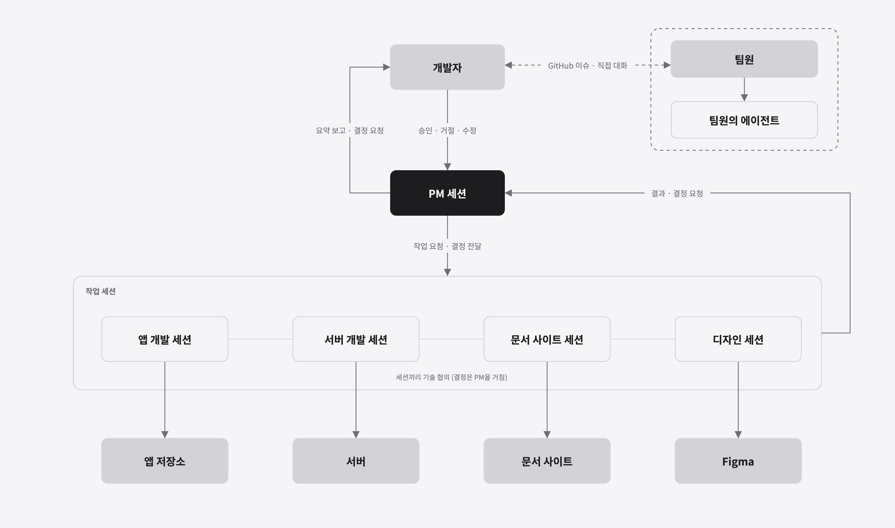
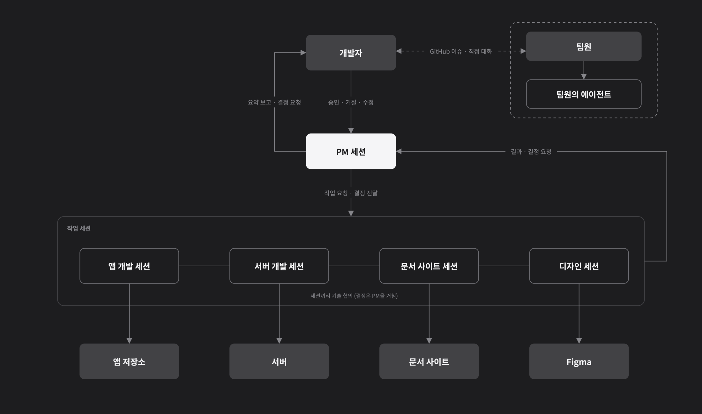

## 개요

[1편](how-casebook-is-built.html)에서는 Casebook을 앱, 서버, 운영 도구, 배포 파이프라인으로 나눈 구조를 정리했습니다. 이 글은 그 구조를 Claude Code 세션 여러 개와 함께 만든 방식을 다룹니다.

첫 버전인 26.10.0을 만들 때까지는 세션 하나로 작업했습니다. 세션 하나가 여러 저장소를 오가며 필요한 곳을 고치는 방식이었습니다. 그런데 작업이 늘어날수록 한 대화 안에 맥락이 쌓였고, 앱 이야기와 서버 이야기, 문서 이야기가 잘 나뉘지 않았습니다.

그래서 세션을 여러 개로 나눴습니다. 다만 세션마다 직접 오가며 대화하는 것도 여전히 비효율적이었습니다. 그래서 세션마다 역할을 분명히 하고 세션끼리 어떻게 소통할지 정해서, 결국 저는 **총괄하는 세션 하나하고만** 대화하도록 설계했습니다.

여러 맥락에서 요청한 작업의 진행 상황은 총괄 세션이 만들어 주는 대시보드로 받아 봅니다. 총괄 세션이 답할 때도 제가 빨리 파악할 수 있도록, 읽는 데 3분 정도면 되는 길이로 쓰고 가능하면 읽기 쉬운 표를 쓰라는 규칙을 넣었습니다.

## 전체 그림




| 세션 | 맡은 일 |
|---|---|
| PM | 개발자와 대화하는 유일한 창구. 일을 나누고, 결정을 모아 묻고, 결과를 요약 |
| 앱 개발 | 네 플랫폼 앱 코드 |
| 서버 개발 | 서버 기능과 데이터베이스 |
| 문서 사이트 | 처리방침, 사건 제작 가이드, 이 블로그 |
| 디자인 | Figma 작업 |

## 세션을 저장소와 역할로 나누기

작업 세션은 저장소 하나, 역할 하나만 맡습니다. 앱 세션은 서버 코드를 고치지 않고, 서버 세션은 앱 화면을 고치지 않습니다.

각 저장소에는 `CLAUDE.md`를 두고 그 저장소의 규칙을 적었습니다. 세션이 새로 열려도 이 파일을 먼저 읽기 때문에, 같은 설명을 매번 다시 할 필요가 없습니다.

```markdown
## 결정 권한
- 이 저장소 안의 구현 방식은 이 세션이 정합니다.
- 커밋 · 배포 · 비용이 드는 일은 PM을 거쳐 개발자에게 묻습니다.

## 함께 작업할 때
- 작업 전과 푸시 직전에 항상 git pull 합니다.
- 다른 사람의 커밋을 덮어쓰지 않습니다.
```

> **참고:** 위 코드는 설명을 위한 예시입니다.

세션끼리는 기술적인 내용을 직접 맞춥니다. 예를 들어 서버 응답 모양이 바뀌면 서버 세션이 앱 세션에 바로 알립니다. 하지만 **결정은 세션끼리 내리지 않고 PM을 거칩니다.**

## 사람의 대화를 PM 세션 하나로 모으기

세션이 다섯 개면 질문도 다섯 곳에서 옵니다. 창을 오가며 답하다 보면 어느 세션에 무엇을 허락했는지 헷갈립니다. 그래서 총괄 역할을 PM 세션에 맡기고, 개발자는 PM 세션하고만 대화합니다.

PM은 결정이 필요한 일을 번호를 붙여 한 형식으로 묻습니다.

| 선택 | 내용 |
|---|---|
| **A (추천)** | 로컬에서 그림을 그려 오늘 받기 |
| B | 도구 사용 한도가 풀릴 때까지 기다리기 |
| C | 유료 플랜으로 올리기 |

개발자는 "132. A"처럼 짧게 답합니다. PM은 이 답을 맡은 세션에 전하고, 결과가 오면 실제로 확인한 뒤 요약해 보고합니다.

> **중요:** 보고는 3분 안에 읽히게, 가능하면 표로 받습니다. 긴 로그를 읽는 순간 사람이 병목이 됩니다.

## 결정은 사람이, 실행은 세션이

| 세션이 직접 하는 일 | 개발자에게 묻는 일 |
|---|---|
| 구현 방식, 코드 구조, 화면 세부 | 출시 · 배포 · 커밋 |
| 테스트와 빌드 확인 | 처리방침 · 약관 문구 |
| 다른 세션과 기술 협의 | 비용이 드는 서비스 |
| 문서와 체크리스트 정리 | 되돌리기 어려운 작업 |

세션 사이에 오가는 메시지는 정보로만 다룹니다. 다른 세션이 "괜찮다"고 해도 그것을 개발자의 허락으로 보지 않습니다. 이 선을 지켜야 세션이 늘어나도 누가 무엇을 정했는지 흐려지지 않습니다.

## 진행 상황을 대시보드 한 장으로 보기

PM은 할 일, 대기 중인 결정, 저장소별 변경 기록을 대시보드 한 장으로 관리합니다. 개발자는 세션을 하나씩 열어 보지 않고 이 화면만 보면 됩니다.

| 칸 | 보여 주는 것 |
|---|---|
| 할 일 | 누가 · 무엇을 · 어느 상태(할 일, 진행 중, 대기, 보류)로 |
| 결정 | 번호, 주제, 답 |
| 변경 기록 | 저장소별 최근 변경 |

## 팀원과 그 에이전트와 함께 일하기

팀원이 합류하면서 팀원의 에이전트도 함께 일하게 됐습니다. 팀원의 세션은 개발자 컴퓨터의 세션과 직접 대화할 수 없기 때문에, 요청은 GitHub 이슈로 주고받고 결정은 개발자와 직접 나눕니다.

팀원이 처음 읽는 온보딩 문서에는 팀원의 에이전트가 첫 세션에서 읽을 순서, 직접 정할 수 있는 범위, 지킬 규칙을 프롬프트로 넣어 두었습니다. 앱 저장소는 새 브랜치에서만 작업하는 것처럼, 사람끼리 지키던 규칙을 에이전트도 같은 방식으로 지킵니다.

## 정리

| 원칙 | 방식 |
|---|---|
| 맥락을 섞지 않기 | 저장소 · 역할마다 세션을 나누고 규칙은 `CLAUDE.md`에 |
| 사람의 대화 창구는 하나 | 개발자는 PM 세션하고만 대화 |
| 결정과 실행을 나누기 | 결정은 번호를 붙여 사람이, 실행은 세션이 |
| 읽는 시간을 줄이기 | 3분 요약, 표, 대시보드 한 장 |
| 사람과 에이전트를 같은 규칙으로 | 팀원의 에이전트도 온보딩 문서와 같은 규칙으로 일함 |

게으른 개발자가 할 일은 결국 두 가지로 줄었습니다. 무엇을 만들지 정하는 것, 그리고 PM이 물어볼 때 답하는 것입니다.
