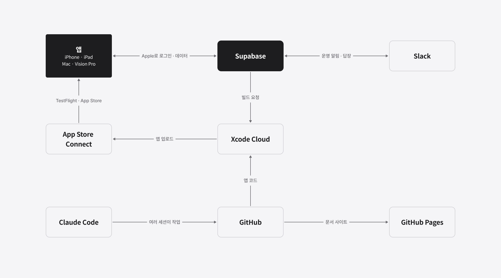
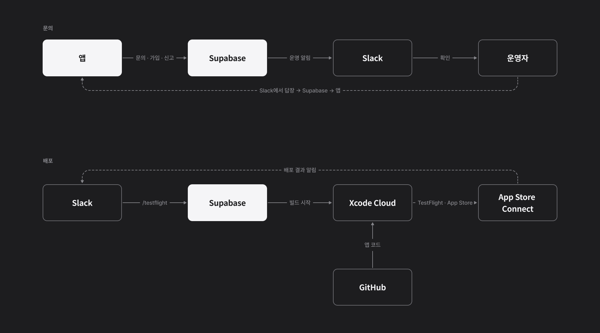
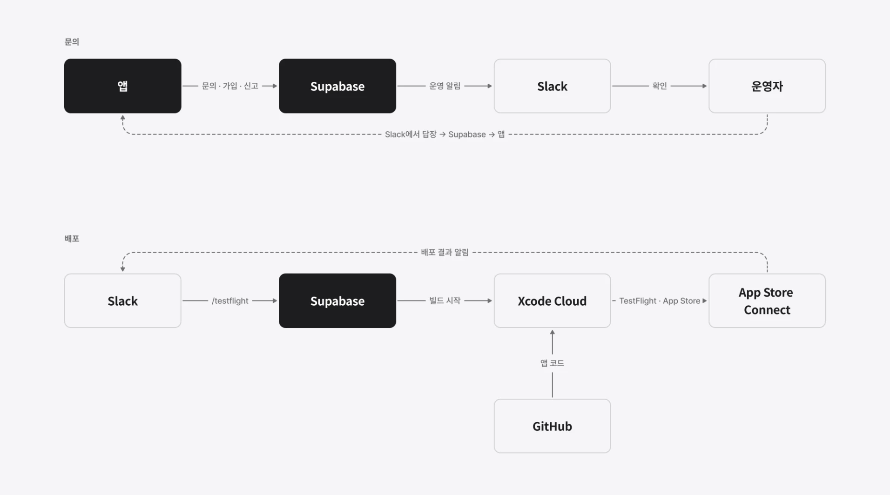
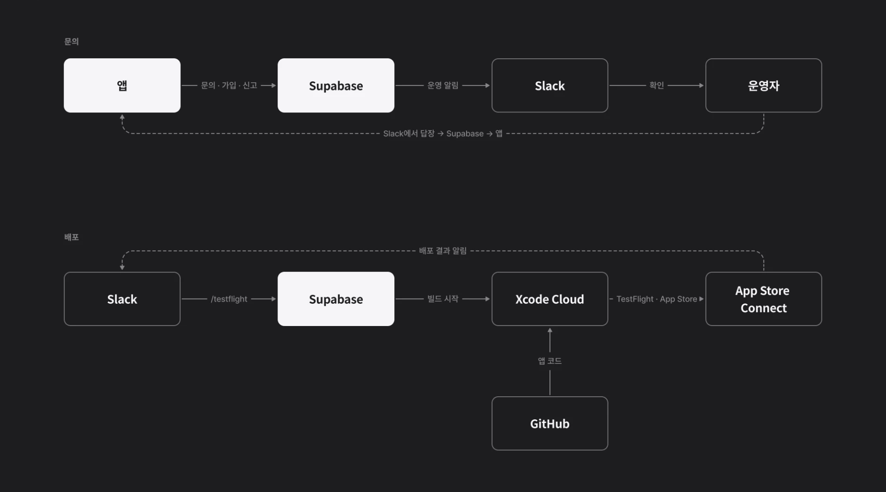

## 개요

Casebook은 iPhone · iPad · Mac · Apple Vision Pro에서 돌아가는 추리 게임입니다. 앱 하나만 있는 것이 아니라, 로그인과 공공 사건기록보관소를 위한 서버, 문의와 신고를 처리하는 운영 도구, 빌드를 올리는 배포 파이프라인, 문서 사이트까지 함께 움직입니다.

이 모든 것을 직접 운영하는 건 정말 귀찮은 일입니다. 게으른 개발자로서 꾸준히 게을러질 수 있도록 직접 손으로 할 일을 줄이는 구조를 만들고 있습니다. 이 글에서는 첫 버전인 26.10.0 버전을 기준으로 그 구조와 이유를 정리해 보았습니다.

## 전체 구조

| 구성 요소 | 맡은 일 |
|---|---|
| 앱 | 네 플랫폼이 하나의 앱. 사건 플레이, 편집기, 공공 보관소 |
| Supabase | 로그인, 데이터 저장, 서버 기능 |
| Slack | 운영 알림을 받고 답장하는 곳, 배포를 시작하는 곳 |
| Xcode Cloud · App Store Connect | 빌드와 TestFlight · App Store 배포 |
| GitHub · GitHub Pages | 코드 저장소, 문서 사이트 |
| Claude Code | 저장소마다 나뉜 코딩 에이전트 세션 |

## 앱과 서버를 Supabase로 연결하기

앱은 Supabase와만 이야기합니다. 로그인은 **Sign in with Apple** 하나로 두었습니다. 로그인하지 않아도 게임은 할 수 있고, 문의처럼 서버가 필요한 기능은 임시 사용자로 먼저 쓰다가 나중에 Apple 계정에 연결할 수 있게 했습니다.

Supabase를 고른 이유는 인증, 데이터베이스, 파일 저장, 서버 함수를 한곳에서 쓸 수 있어서입니다. 서버를 따로 띄우고 관리하지 않아도 되는 점이 작은 팀에 맞았습니다. Apple Vision Pro 앱은 서버 없이 기기와 iCloud만으로 동작합니다.

## 운영 알림과 답장을 Slack 한곳에 모으기

앱에서 문의, 가입, 신고 같은 일이 생기면 Supabase가 Slack으로 알림을 보냅니다. 운영자는 관리 화면을 따로 열지 않고 Slack에서 바로 확인합니다.

문의에는 Slack 메시지의 **답장 쓰기** 버튼으로 답합니다. 답장은 Supabase를 거쳐 앱의 받은 편지함에 도착합니다.

> **참고:** 운영 도구를 새로 만들지 않고 이미 매일 쓰는 Slack에 붙인 덕분에, 알림을 놓치거나 화면을 오가는 일이 줄었습니다.

## Slack 명령 하나로 TestFlight까지 배포하기

배포도 Slack에서 시작합니다. 위 그림의 아래쪽 흐름입니다. `/testflight`를 보내면 Supabase가 Xcode Cloud에 빌드를 요청합니다. Xcode Cloud는 GitHub의 앱 코드를 빌드해 App Store Connect로 올리고, 결과는 다시 Slack에 알림으로 돌아옵니다.

| 단계 | 하는 곳 |
|---|---|
| 배포 시작 | Slack `/testflight` |
| 빌드 요청 | Supabase → Xcode Cloud |
| 빌드 · 업로드 | Xcode Cloud → App Store Connect |
| 결과 알림 | Slack |

빌드 번호는 Xcode Cloud가 매긴 번호를 그대로 씁니다. 하나의 앱이 Mac까지 함께 배포되기 때문에, 버전이 바뀌어도 빌드 번호는 계속 커지게 두었습니다.

> **중요:** 같은 명령이 짧은 시간에 두 번 들어와도 빌드가 한 번만 시작되게 막았습니다. 메시지가 다시 전송되는 경우가 실제로 있었습니다.

## 코드와 문서를 GitHub에 나눠 두기

앱, 서버, 문서 사이트는 저장소를 나눴습니다. 문서 사이트는 GitHub Pages로 배포하고, 개인정보 처리방침과 이 개발 블로그가 여기에 있습니다.

코드 작업은 Claude Code와 함께 했습니다. 저장소마다 세션을 따로 두고, 결정은 한곳으로 모아 사람이 내렸습니다. 세션마다 맡은 범위가 분명해서, 여러 저장소를 동시에 고쳐도 서로 엉키지 않았습니다.

## 정리

| 원칙 | 구조에 반영한 방식 |
|---|---|
| 서버 관리 운영 리소스를 줄이기 | 인증 · 데이터 · 서버 기능을 Supabase 하나로 |
| 매일 쓰는 도구에서 운영하기 | 알림, 답장, 배포 시작을 모두 Slack에서 |
| 손으로 하는 배포 없애기 | Slack 명령 → Xcode Cloud → App Store Connect |
| 맡은 범위 나누기 | 저장소별 세션, 결정은 한곳에서 |
